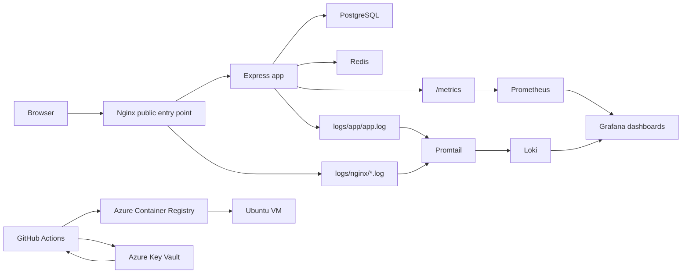

# DevOps Guided Project

This repository is a guided, hands-on DevOps project for junior engineers. The application is intentionally small. The main learning goal is to understand how a service moves through a practical delivery path:

`design request -> local runtime -> observability -> image build -> registry publish -> VM deployment -> validation -> recovery`

## Project Purpose

Treat this repository as the response to a realistic request sent to a DevOps team:

> "We have a small service that needs to run in a training environment. Package it into a container, expose it safely, connect it to PostgreSQL and Redis, make it observable with logs and metrics, publish it through CI, deploy it to a VM, and make validation and recovery straightforward."

This project implements that request with a small Express app, Docker Compose, Nginx, PostgreSQL, Redis, Grafana, Prometheus, Loki, GitHub Actions, Azure Container Registry, and a single Ubuntu VM deployment path.

## Who This Is For

- junior DevOps engineers
- junior cloud engineers
- instructors running a guided workshop
- teams who need a simple but realistic end-to-end delivery example

The repository assumes basic familiarity with Linux commands, Git, Docker basics, and CI/CD concepts. It does not assume deep backend development experience.

## Scope

This project is designed to teach:

- how a service is structured and run with Docker Compose
- how a reverse proxy sits in front of an application
- how PostgreSQL and Redis support application behavior
- how logs and metrics answer different operational questions
- how CI builds and publishes a container image
- how a VM deploy consumes an existing image instead of rebuilding
- how to validate a deployment and recover from simple failures

This project is not intended to teach:

- Kubernetes
- Terraform or Ansible
- large microservice architecture
- complex application business logic
- enterprise-grade secrets or platform hardening

## First Reading Order

If you are opening the repository for the first time, use this order:

1. [Documentation Guide](docs/00-documentation-guide.md)
2. [Prerequisites and Validation](docs/01-prerequisites-and-validation.md)
3. [Architecture](docs/02-architecture.md)
4. [Runtime Stack](docs/03-runtime-stack.md)
5. [App GUI](docs/04-app-gui.md)
6. [Request And Data Flow](docs/05-request-and-data-flow.md)
7. [Logging](docs/06-logging.md)
8. [Monitoring](docs/07-monitoring.md)
9. [Registries](docs/08-registries.md)
10. [Azure Key Vault and Secrets Flow](docs/09-secrets-and-azure-key-vault.md)
11. [VM Deployment](docs/10-vm-deployment.md)
12. [Troubleshooting](docs/11-troubleshooting.md)
13. [Trainee Validation Findings](docs/12-trainee-validation-findings.md)

## System Summary

At a high level:

- the browser talks to Nginx
- Nginx forwards traffic to the Express app
- the app uses PostgreSQL for persistent data
- the app uses Redis for the cache demo
- the app writes structured logs and exposes metrics
- Prometheus stores metrics
- Promtail ships app and Nginx log files into Loki
- Grafana provides the main observability UI
- GitHub Actions builds and publishes the app image to ACR
- the VM deployment path pulls that image and starts the stack with Docker Compose



For the detailed explanation, read [Architecture](docs/02-architecture.md).

## Repository Structure

```text
.
├── README.md
├── app/                         # Express app, GUI assets, tests
├── db/                          # PostgreSQL initialization script
├── docker/                      # Dockerfile and Nginx configuration
├── monitoring/                  # Prometheus, Loki, Promtail, Grafana config
├── deploy/                      # VM setup and deployment scripts
├── docs/                        # Ordered documentation set
├── labs/                        # Guided workshop labs
├── instructor/                  # Instructor notes and timing
├── logs/                        # Host-side app and Nginx logs
├── scripts/                     # Validation and helper scripts
├── docker-compose.yml           # Local training stack
├── docker-compose.vm.yml        # VM runtime stack
└── .github/workflows/           # CI build/publish and VM deploy workflows
```

## Main Runtime Components

| Component | Role | Public Exposure |
| --- | --- | --- |
| `nginx` | public entry point and reverse proxy | local `:8080`, VM `:80` |
| `app` | GUI, API, metrics, structured logs | internal only |
| `postgres` | persistent `items` data | internal only |
| `redis` | cache demo | internal only |
| `prometheus` | metric storage | local `:9090`, VM localhost-only |
| `grafana` | dashboards and log exploration | local `:3000`, VM localhost-only |
| `loki` | log storage for app and Nginx | internal only |
| `promtail` | log shipping from host files | internal only |

## Setup

Start with [Prerequisites and Validation](docs/01-prerequisites-and-validation.md).

If you want the short version:

```bash
bash scripts/validate-prerequisites.sh
cp .env.example .env
docker compose up --build
```

Then validate the local stack:

```bash
bash scripts/validate-local-stack.sh
```

## Local Usage Flow

1. Start the stack with `docker compose up --build`.
2. Open the GUI at [http://localhost:8080](http://localhost:8080).
3. Use the GUI to generate health, readiness, DB, cache, slow, and error traffic.
4. Validate the stack with `bash scripts/validate-local-stack.sh`.
5. Inspect logs in Grafana Explore or with `docker compose logs`.
6. Inspect metrics in Grafana and Prometheus.
7. Run `cd app && npm ci && npm test` when you need the app test path.

Local URLs:

- app GUI: [http://localhost:8080](http://localhost:8080)
- Grafana: [http://localhost:3000](http://localhost:3000)
- Prometheus: [http://localhost:9090](http://localhost:9090)

## Validation Scripts

These scripts are part of the expected workflow, not optional extras.

- `bash scripts/validate-prerequisites.sh`
- `bash scripts/validate-local-stack.sh`
- `bash scripts/validate-observability.sh`
- `bash scripts/validate-vm-deployment.sh http://YOUR_VM_OR_LOCAL_URL`
- `bash scripts/validate-project.sh`

## CI/CD Flow

The repository includes two main workflows:

- `.github/workflows/ci-build-push.yml`
  - pull request: test only
  - push to `main`: test, build, and publish the app image to ACR
- `.github/workflows/deploy-vm.yml`
  - manual deploy of a selected image tag to the Ubuntu VM
  - Azure Key Vault preferred for runtime secrets
  - GitHub Secrets fallback when Key Vault is not ready

Related reading:

- [Registries](docs/08-registries.md)
- [Azure Key Vault and Secrets Flow](docs/09-secrets-and-azure-key-vault.md)
- [VM Deployment](docs/10-vm-deployment.md)

## VM Deployment Summary

The VM deployment path is intentionally simple:

1. prepare the VM with `deploy/vm-setup.sh`
2. provide `.env` and runtime secrets
3. pull the published app image from ACR
4. start the VM stack with `docker-compose.vm.yml`
5. validate `/health`, `/ready`, and `/version`
6. use an SSH tunnel for Grafana on the VM

If you need to copy the source to the VM from a workstation instead of cloning it there, use:

```bash
bash scripts/package-vm-source.sh
```

That helper avoids macOS metadata files that can break Linux-side provisioning.

## Labs

The labs are designed to match the delivery story:

- [LAB-00 Course Map](labs/LAB-00-course-map.md)
- [LAB-01 Run Locally and Use GUI](labs/LAB-01-run-locally-and-use-gui.md)
- [LAB-02 Compose Layers DB Cache](labs/LAB-02-compose-layers-db-cache.md)
- [LAB-03 Nginx Reverse Proxy](labs/LAB-03-nginx-reverse-proxy.md)
- [LAB-04 Logging Dashboard](labs/LAB-04-logging-dashboard.md)
- [LAB-05 Metrics and Grafana](labs/LAB-05-metrics-and-grafana.md)
- [LAB-06 GitHub Actions ACR](labs/LAB-06-github-actions-acr.md)
- [LAB-07 Deploy to VM](labs/LAB-07-deploy-to-vm.md)
- [LAB-08 Failure and Recovery](labs/LAB-08-failure-and-recovery.md)

## Operational Notes

- Nginx is the only public entry point by design.
- The app is not meant to be exposed directly.
- On the VM, Grafana and Prometheus stay localhost-only by default.
- Loki only stores app and Nginx logs in this course. PostgreSQL and Redis logs stay in CLI logs to keep the scope manageable.
- The project favors explicit files and visible runtime behavior over abstraction.

## Where To Go Next

- new engineer: [Documentation Guide](docs/00-documentation-guide.md)
- guided workshop path: [LAB-00 Course Map](labs/LAB-00-course-map.md)
- deployment work: [VM Deployment](docs/10-vm-deployment.md)
- when something is broken: [Troubleshooting](docs/11-troubleshooting.md)
