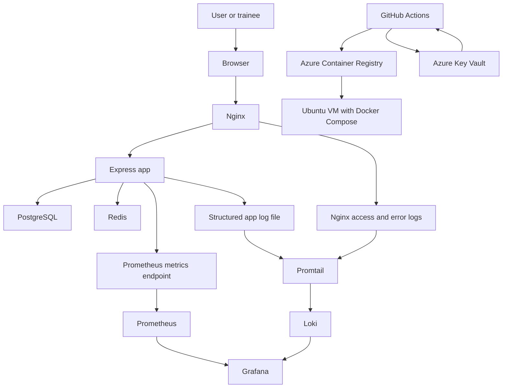

# Architecture

This document explains how the project is structured, why the components were chosen, how they interact, and what operational assumptions the design makes.

Use it after [01-prerequisites-and-validation](01-prerequisites-and-validation.md) and before the runtime and flow documents.

## 1. Architecture Goal

The architecture is intentionally small but production-like.

The project needs to satisfy a practical DevOps request:

- run a web service in containers
- provide one safe public entry point
- connect the service to a database and a cache
- expose useful logs and metrics
- package the service into an image
- publish that image through CI
- deploy the image to one Ubuntu VM
- validate and troubleshoot the deployed system

The design is not trying to maximize technical sophistication. It is trying to maximize clarity, repeatability, and teachability.

## 2. System Context

At a high level, the system has four layers:

1. application layer
2. runtime and networking layer
3. observability layer
4. delivery and deployment layer

## 3. Main Components And Responsibilities

### 3.1 Express App

Main responsibility:

- serve the GUI
- expose the JSON API
- expose `/metrics`
- coordinate database and cache access
- emit structured logs

Why it exists:

- it gives trainees a simple service they can run, inspect, and deploy
- it stays small so the learning focus remains on runtime, operations, and delivery

Important behavior:

- `/health` checks process-level health
- `/ready` checks PostgreSQL and Redis connectivity
- `/version` shows deployment metadata
- `/items` uses PostgreSQL
- `/cache-demo` uses Redis
- `/slow` creates visible latency
- `/error` creates a controlled `500`

Design decision:

- the app includes both the GUI and API in one service

Why:

- fewer moving parts
- no frontend build system
- a clearer request path for new engineers

Trade-off:

- this is less realistic than a larger split frontend/backend platform
- it is more appropriate for a six-hour guided DevOps project

### 3.2 PostgreSQL

Main responsibility:

- store persistent relational data for the `items` table

Why it exists:

- trainees need one real persistence layer
- `/items` gives a clear example of stateful behavior

Design decision:

- one simple table and seed data

Why:

- enough to demonstrate persistence, readiness, and troubleshooting
- not enough to drag the project into schema design or application complexity

Operational note:

- PostgreSQL data lives in a named Docker volume
- in a real production environment, backup and restore design would matter much more than it does here

### 3.3 Redis

Main responsibility:

- support a simple cache demo path

Why it exists:

- it lets trainees compare persistent data with cached data
- it creates a second runtime dependency for readiness and troubleshooting

Design decision:

- use one narrow cache route instead of broad cache integration

Why:

- trainees can see cache hit and cache miss behavior clearly
- the app logic stays understandable

Trade-off:

- Redis is used more as a teaching dependency than as a full caching strategy

### 3.4 Nginx

Main responsibility:

- be the only intended public entry point
- reverse proxy requests to the app
- record access and error logs

Why it exists:

- it separates public access from the application process
- it gives trainees a visible traffic boundary
- it makes request timing and status visible even when the app fails

Design decision:

- do not expose the app publicly
- do not expose `/metrics` publicly

Why:

- the project teaches safer defaults
- it reinforces the idea that not every useful endpoint should be public

Operational note:

- Nginx logs are written to files under `logs/nginx/`
- those files are useful both for CLI inspection and for Loki ingestion

### 3.5 Prometheus

Main responsibility:

- scrape and store app metrics

Why it exists:

- metrics answer trend questions such as:
  - is traffic arriving?
  - did errors increase?
  - did latency increase?
  - are readiness checks healthy?

Design decision:

- scrape only the application metrics

Why:

- keeps the monitoring scope small
- avoids turning the course into a general infrastructure monitoring workshop

Trade-off:

- trainees do not get node-level or container-level metrics by default
- that is acceptable because the main lesson is application-centered observability

### 3.6 Loki And Promtail

Main responsibility:

- store application and Nginx logs in a queryable form

Why they exist:

- logs answer request-level questions that metrics cannot answer on their own

Design decision:

- ship only app logs and Nginx logs
- keep PostgreSQL and Redis logs in `docker compose logs` only

Why:

- that log scope is large enough to explain request flow clearly
- it avoids turning the course into a full log aggregation platform exercise

Trade-off:

- not every service is centralized in Grafana
- the observability story stays narrower and easier to teach

Operational note:

- Promtail reads host-visible log files, not Docker socket streams
- that makes the path more explicit and easier for trainees to reason about

### 3.7 Grafana

Main responsibility:

- provide one main observability UI for dashboards and logs

Why it exists:

- it reduces context switching
- trainees can compare metrics and logs in one place

Design decision:

- local environment: Grafana is directly reachable
- VM environment: Grafana is localhost-only and reached through SSH tunnel

Why:

- local learning should be easy
- VM exposure should default to safer behavior

## 4. Runtime Modes

The project has two runtime modes.

### 4.1 Local Training Mode

Defined by:

- `docker-compose.yml`

Purpose:

- support labs, local validation, and troubleshooting

Behavior:

- builds the app image from local source
- publishes Nginx on `http://localhost:8080`
- publishes Grafana on `http://localhost:3000`
- publishes Prometheus on `http://localhost:9090`

Why this mode exists:

- trainees need fast local feedback
- they should be able to inspect the stack without depending on cloud access

### 4.2 VM Deployment Mode

Defined by:

- `docker-compose.vm.yml`

Purpose:

- run the app on a single Ubuntu VM using a published image

Behavior:

- pulls the app image from ACR
- publishes Nginx on port `80`
- keeps Grafana and Prometheus localhost-only by default
- reads stable configuration from `.env`
- reads sensitive runtime values from `.env.secrets`

Why this mode exists:

- it reinforces the principle that deployment should consume an image that CI already built

Trade-off:

- the deployment target is intentionally simple
- it does not represent multi-node orchestration or hardened production infrastructure

## 5. Request Flow

For a normal browser request:

1. the browser sends a request to Nginx
2. Nginx forwards the request to the Express app
3. the app handles the route
4. the app may query PostgreSQL or Redis
5. the app returns the response through Nginx
6. the app writes structured logs
7. Nginx writes access or error logs
8. request metrics are updated
9. Promtail ships app and Nginx log files to Loki
10. Grafana can show both the metric trend and the request logs

Why this matters:

- the request path is visible end to end
- trainees can answer not only "did it fail?" but also "where did it fail?"

For the route-by-route explanation, read [05-request-and-data-flow](05-request-and-data-flow.md).

## 6. Data Flow

There are three main data flows in the project.

### 6.1 Request And Response Data

- browser -> Nginx -> app -> browser

This is the main traffic path.

### 6.2 Persistent Data

- app -> PostgreSQL -> app

This path is used for `GET /items` and `POST /items`.

### 6.3 Cache Data

- app -> Redis -> app

This path is used for `GET /cache-demo`.

Why the distinction matters:

- trainees learn that not every backend dependency serves the same purpose
- database state and cache state behave differently during failure and recovery

## 7. Observability Flow

The project intentionally keeps observability easy to explain.

Metrics flow:

- app exposes `/metrics`
- Prometheus scrapes the app internally
- Grafana dashboards show trends and health signals

Log flow:

- app writes structured logs to `logs/app/app.log`
- Nginx writes access and error logs to `logs/nginx/`
- Promtail reads those files
- Loki stores those logs
- Grafana Explore queries them

Why it is designed this way:

- metrics answer "that something changed"
- logs answer "what request changed and why"

Operational consideration:

- if Grafana log queries are unavailable, trainees can still fall back to file logs and `docker compose logs`

## 8. Build And Deployment Flow

The delivery path is:

1. developers change the repository
2. GitHub Actions runs tests
3. on `main`, CI builds the app image
4. CI pushes the image to ACR
5. the deploy workflow selects an image tag
6. the VM pulls that image
7. Docker Compose starts the VM stack
8. smoke tests validate `/health` and `/ready`

Why it is designed this way:

- it separates build from deploy
- it teaches image immutability and reuse
- it lets recovery be as simple as redeploying a previous tag

Trade-off:

- this is a lightweight deployment pattern, not a progressive delivery platform

## 9. Dependencies

Important dependencies include:

- Docker Engine and Docker Compose
- Node.js 20 for app test and validation workflows
- GitHub Actions for CI/CD
- ACR for the published image path
- Azure Key Vault as the preferred runtime secret source
- Ubuntu VM with Docker Compose for deployment

Dependency design principle:

- use as few external systems as possible while still teaching a realistic delivery chain

## 10. Key Design Decisions

### Single public entry point

Reason:

- easier network model
- easier log inspection
- safer default than exposing many services

### One small app instead of many services

Reason:

- students should learn runtime and delivery behavior, not application decomposition

### Grafana as the main observability UI

Reason:

- lower operational and teaching friction
- logs and metrics can be compared in one place

### Only app image published to the registry

Reason:

- keeps the registry story focused
- avoids turning the exercise into infrastructure image management

### VM deployment consumes an existing image

Reason:

- deployment should be about running a known artifact, not rebuilding source code on the target host

## 11. Trade-Offs And Assumptions

This architecture makes several deliberate simplifications.

Trade-offs:

- one service instead of multiple cooperating apps
- one VM instead of a clustered platform
- one main observability UI instead of separate products for each concern
- only application metrics by default
- only app and Nginx logs in Loki

Assumptions:

- the environment is controlled and suitable for guided training
- one VM is enough for the delivery story
- trainees benefit more from explicit components than from abstraction

## 12. Risks And Operational Considerations

Relevant operational considerations:

- if Docker is installed but the user is not in the `docker` group, local validation will fail until the shell is refreshed
- if source is copied from macOS to Linux carelessly, `._*` metadata files can break Grafana provisioning
- if the same Linux host is used for both the local lab stack and the VM stack, ports can conflict unless the first stack is stopped
- if ACR or Azure Key Vault are unavailable, the GitHub Secrets fallback path is required to keep the workshop moving
- if Grafana logs are temporarily unavailable, CLI logs and file logs are still valid troubleshooting tools

These are not hidden edge cases. They are part of the real operational behavior trainees should learn to recognize.

## 13. Why The Architecture Is Designed This Way

The architecture is designed to balance three needs:

1. it must be realistic enough to look like real platform work
2. it must be simple enough to complete in a guided workshop
3. it must be explicit enough that a new engineer can follow the full chain without extra explanation

That is why the project favors:

- visible configuration files
- clear runtime boundaries
- safe default exposure
- narrow but useful observability
- a build-once, deploy-many mindset

## Next Step

Continue with:

1. [03-runtime-stack](03-runtime-stack.md)
2. [04-app-gui](04-app-gui.md)
3. [05-request-and-data-flow](05-request-and-data-flow.md)

Then start [LAB-01 Run Locally and Use GUI](../labs/LAB-01-run-locally-and-use-gui.md).
